# Unified Input System

Design document for refactoring the canvas frame/unit system into a unified "Input" architecture with clear role-based naming.

## Problem Statement

The current system has several UX problems:

1. **Confusing terminology** — "Input frame", "Unit frame", "Asset type" are internal concepts that don't communicate purpose to users
2. **No role flexibility on the Input frame** — it's always img2img when an image is present, but edit models (Klein, Qwen Edit) need the image passed as-is without denoising
3. **"Asset" is meaningless** — users cannot guess that "Asset" means "pass image without processing"
4. **"Reference" is overloaded** — the name "Reference" is used for a specific ControlNet attention-injection technique, but "reference image" is a general concept users expect to mean "here's an image for context"
5. **Two separate frame systems** — Input frame (special, multi-layer) and Unit frames (simple, single-image) are architecturally different but conceptually both "images the model uses"

## Current Architecture

### Frame Types

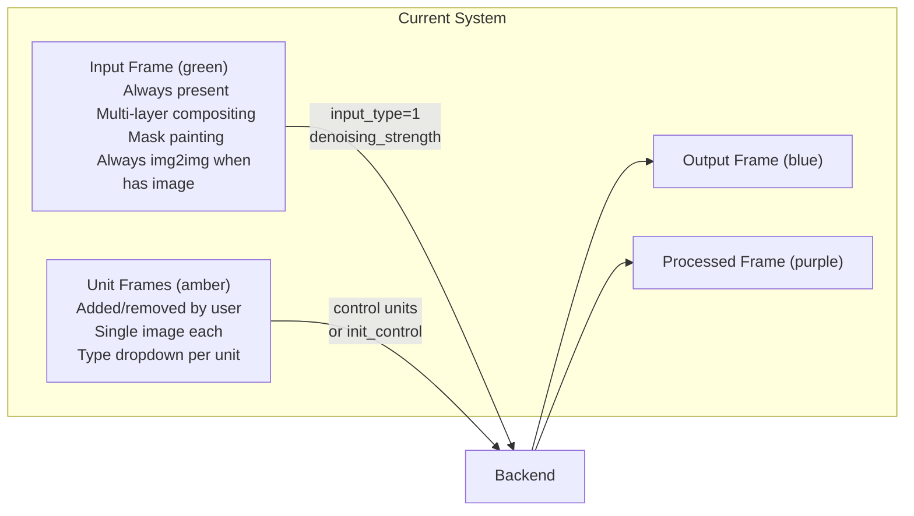

### Current Unit Type Dropdown

```text
Asset           ← meaningless name, passes image as-is
ControlNet      ← processor + control model
T2I-Adapter     ← processor + control model
XS              ← processor + control model
Lite            ← processor + control model
Reference       ← attention/adain injection (name conflicts with general concept)
IP-Adapter      ← CLIP image embedding
```

### Backend Constraints (Cannot Change)

The backend enforces a single control type per generation. All active control units must be the same type, with one exception: IP-Adapter is architecturally separate (a pipeline modifier via `pipe.load_ip_adapter()`) and can coexist with any control type.

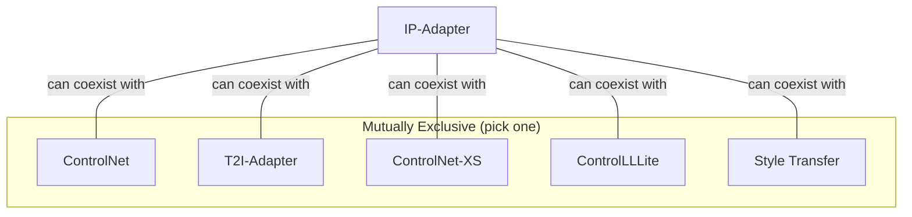

## Proposed Architecture

### Core Concept — Everything is an Input

Replace the Input/Unit distinction with a single unified concept: **Input**. Each Input has a **role** that determines its capabilities and how the image is sent to the backend.

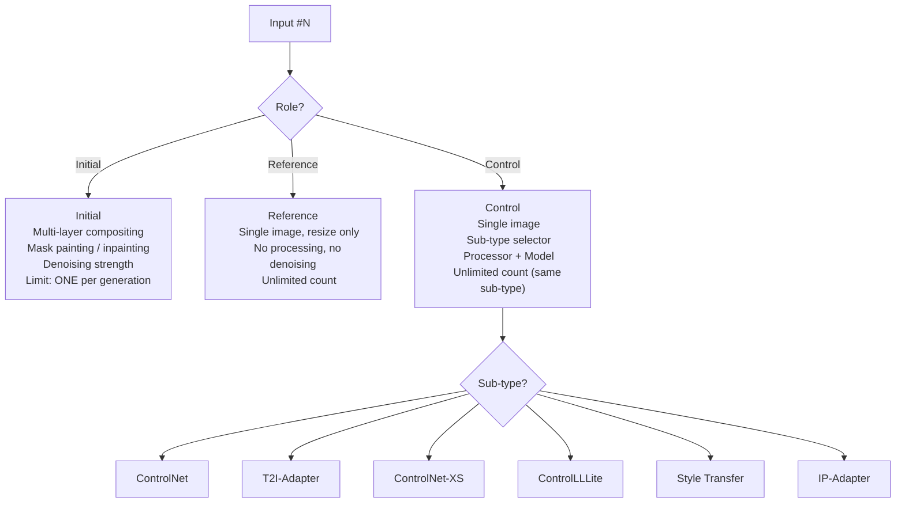

### The Three Roles

| Role | What It Does | Image Handling | Backend Mapping |
| --- | --- | --- | --- |
| **Initial** | Base image for img2img / inpainting | Multi-layer compositing, mask painting, denoising strength | `input_type=1`, image sent as `inputs`, denoising applied |
| **Reference** | Image passed directly to the model | Single image, resize/fit only | `input_type=0` or `init_control`, image passed as-is |
| **Control** | Image processed and/or sent to control model | Single image, fit modes | Sent via `control` array with processor/model config |

### Naming Changes

| Current Name | New Name | Reason |
| --- | --- | --- |
| Input frame | **Input #1 (Initial)** | Unified naming, role made explicit |
| Unit frame (Asset) | **Input #N (Reference)** | Describes purpose — a reference image |
| Unit frame (ControlNet) | **Input #N (Control: ControlNet)** | Role + sub-type |
| Unit frame (Reference) | **Input #N (Control: Style Transfer)** | Frees "Reference" for the general concept |
| Unit frame (IP-Adapter) | **Input #N (Control: IP-Adapter)** | Consistent with other control sub-types |

### Rename Summary

```text
"Asset"     → "Reference"       (the image IS a reference)
"Reference" → "Style Transfer"  (describes what the technique does)
"Input"     → "Initial"         (specific role, not a generic label)
```

## Role Capabilities

### Detailed Capability Matrix

| Capability | Initial | Reference | Control |
| --- | --- | --- | --- |
| Multiple image layers | Yes | No (single) | No (single) |
| Free compositing (position/scale/rotate) | Yes | No | Fit modes only |
| Mask painting / inpainting | Yes | No | No |
| Denoising strength | Yes | No | No |
| Processor selection | No | No | Yes (sub-type dependent) |
| Control model | No | No | Yes (sub-type dependent) |
| Strength / timing sliders | No | No | Yes |
| Max count per generation | **1** | Unlimited | Unlimited |

### Control Sub-Type Features

| Feature | ControlNet | T2I | XS | Lite | Style Transfer | IP-Adapter |
| --- | --- | --- | --- | --- | --- | --- |
| Processor | Yes | Yes | Yes | Yes | No | No |
| Control model | Yes | Yes | Yes | Yes | No | No (adapter model) |
| Strength | Yes | Yes | Yes | Yes | No | No (scale) |
| Timing (start/end) | Yes | No | Yes | No | No | Yes |
| Guess mode | Yes | No | No | No | No | No |
| Factor | No | Yes | No | No | No | No |
| Attention/Adain/Fidelity | No | No | No | No | Yes | No |
| Adapter model/scale/crop | No | No | No | No | No | Yes |
| Control image | Yes | Yes | Yes | Yes | Yes | No (own images) |

## Constraint System

### Role Constraints

When the user adds a new Input or changes an existing Input's role, constraints are enforced by disabling unavailable options.

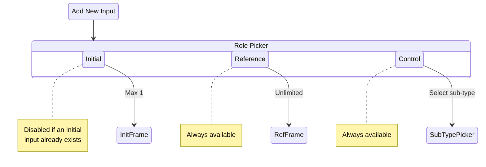

### Control Sub-Type Compatibility

Once any non-IP-Adapter control sub-type is chosen, it locks the control type for all other Control inputs. IP-Adapter is always available because it operates as a separate pipeline modifier.

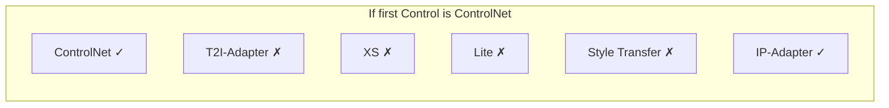

**Full compatibility matrix (rows = existing choice, columns = what remains available)**

| Existing Control Sub-Type | ControlNet | T2I | XS | Lite | Style Transfer | IP-Adapter |
| --- | --- | --- | --- | --- | --- | --- |
| ControlNet | Available | Disabled | Disabled | Disabled | Disabled | Available |
| T2I-Adapter | Disabled | Available | Disabled | Disabled | Disabled | Available |
| XS | Disabled | Disabled | Available | Disabled | Disabled | Available |
| Lite | Disabled | Disabled | Disabled | Available | Disabled | Available |
| Style Transfer | Disabled | Disabled | Disabled | Disabled | Available | Available |
| IP-Adapter only | Available | Available | Available | Available | Available | Available |

### Changing Sub-Type with Existing Inputs

When the user attempts to change a Control input's sub-type and other Control inputs already exist with a different type:

1. **If changing TO IP-Adapter** — always allowed (IP-Adapter is universally compatible)
2. **If changing FROM IP-Adapter to X** — allowed only if all other non-IP-Adapter Controls are already type X
3. **If changing from X to Y** — blocked with message: "Other Control inputs use X. Remove or change them first."

## UI Layout

### Canvas Frame Arrangement

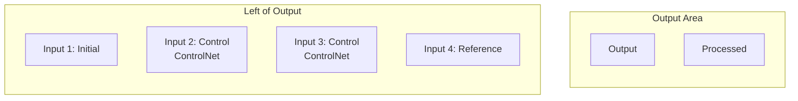

### Frame Header Design

Each frame header displays two pieces of information: the **global index** and the **role** (with sub-type for Control inputs).

```text
┌─────────────────────────┐
│ 1: Initial        [▾][×]│  ← role dropdown + remove button
│  ┌───────────────────┐  │
│  │ (image layers)    │  │
│  │ (mask overlay)    │  │
│  └───────────────────┘  │
│  Denoising: ████░░ 0.65 │
└─────────────────────────┘

┌─────────────────────────┐
│ 2: Control        [▾][×]│
│  Sub: ControlNet   [▾]  │  ← sub-type dropdown (only for Control role)
│  ┌───────────────────┐  │
│  │ (control image)   │  │
│  └───────────────────┘  │
│  Proc: Canny       [▾]  │
│  Model: v11p_canny [▾]  │
│  Strength: ████░░ 0.80  │
└─────────────────────────┘

┌─────────────────────────┐
│ 3: Reference      [▾][×]│
│  ┌───────────────────┐  │
│  │ (reference image) │  │
│  └───────────────────┘  │
│  (no settings)          │
└─────────────────────────┘
```

### Global Numbering

Inputs are numbered sequentially with a single global counter. This counter:

- Matches internal unit indices (important for positional matching in multi-ControlNet)
- Appears in the image source dropdown ("use image from Input 3")
- Maintains order, which matters for multi-model pairing in the backend

```text
Two ControlNets + one Reference:

    1: Control (ControlNet)    2: Control (ControlNet)    3: Reference

User deletes Input 1, remaining renumber:

    1: Control (ControlNet)    2: Reference
```

### Adding New Inputs

The "+" button presents a role picker:

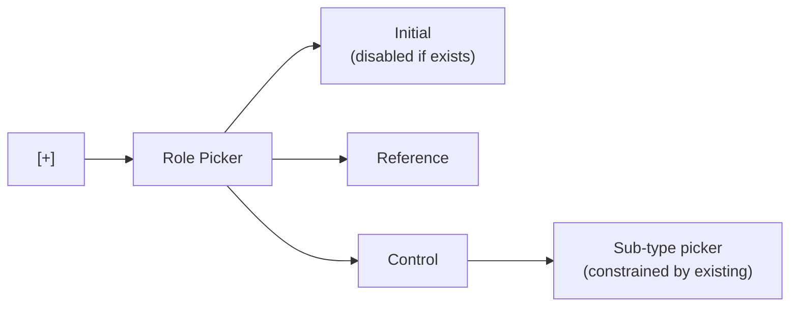

## Example Scenarios

### Scenario 1 — Basic img2img

```text
┌──────────────┐  ┌──────────┐
│ 1: Initial   │  │ Output   │
│ (photo)      │  │          │
│ Denoise: 0.5 │  │          │
└──────────────┘  └──────────┘
```

Backend: `input_type=1`, denoising_strength=0.5

### Scenario 2 — Edit model (Klein/Qwen)

```text
┌──────────────┐  ┌──────────┐
│ 1: Reference │  │ Output   │
│ (source img) │  │          │
└──────────────┘  └──────────┘
```

Backend: image sent via `init_control`, no denoising, model edits based on prompt

### Scenario 3 — Multi-reference edit

```text
┌──────────────┐  ┌──────────────┐  ┌──────────┐
│ 1: Reference │  │ 2: Reference │  │ Output   │
│ (scene)      │  │ (style ref)  │  │          │
└──────────────┘  └──────────────┘  └──────────┘
```

Backend: multiple `init_control` images for multi-image edit pipeline

### Scenario 4 — img2img + ControlNet

```text
┌──────────────┐  ┌──────────────┐  ┌──────────┐  ┌──────────┐
│ 1: Initial   │  │ 2: Control   │  │ Output   │  │ Processed│
│ (base photo) │  │ ControlNet   │  │          │  │ (edges)  │
│ Denoise: 0.6 │  │ Proc: Canny  │  │          │  │          │
└──────────────┘  └──────────────┘  └──────────┘  └──────────┘
```

Backend: `input_type=1`, denoising + ControlNet conditioning

### Scenario 5 — Multi-ControlNet (two poses)

```text
┌──────────────┐  ┌──────────────┐  ┌──────────┐  ┌──────────┐
│ 1: Control   │  │ 2: Control   │  │ Output   │  │ Processed│
│ ControlNet   │  │ ControlNet   │  │          │  │          │
│ Proc: DWPose │  │ Proc: DWPose │  │          │  │          │
│ (person A)   │  │ (person B)   │  │          │  │          │
└──────────────┘  └──────────────┘  └──────────┘  └──────────┘
```

Backend: MultiControlNetModel, images positionally matched to models by index

### Scenario 6 — ControlNet + IP-Adapter (valid mix)

```text
┌──────────────┐  ┌──────────────┐  ┌──────────┐
│ 1: Control   │  │ 2: Control   │  │ Output   │
│ ControlNet   │  │ IP-Adapter   │  │          │
│ Proc: Depth  │  │ Adapter: v1  │  │          │
│ Model: v11f  │  │ Scale: 0.8   │  │          │
└──────────────┘  └──────────────┘  └──────────┘
```

Backend: ControlNet pipeline + IP-Adapter modifier applied independently

### Scenario 7 — Inpainting

```text
┌──────────────┐  ┌──────────┐
│ 1: Initial   │  │ Output   │
│ (composited  │  │          │
│  layers with │  │          │
│  mask)       │  │          │
│ Denoise: 0.7 │  │          │
└──────────────┘  └──────────┘
```

Backend: `input_type=1` with mask, inpainting pipeline

### Scenario 8 — Processor-only (no control model)

```text
┌──────────────┐  ┌──────────────┐  ┌──────────┐  ┌──────────┐
│ 1: Initial   │  │ 2: Control   │  │ Output   │  │ Processed│
│ (photo)      │  │ ControlNet   │  │          │  │ (depth)  │
│ Denoise: 0.5 │  │ Proc: Depth  │  │          │  │          │
│              │  │ Model: (none)│  │          │  │          │
└──────────────┘  └──────────────┘  └──────────┘  └──────────┘
```

Backend: processor runs, output passed as processed image for img2img, no control model conditioning

### Scenario 9 — Pure txt2img

```text
                   ┌──────────┐
    [+ Add Input]  │ Output   │
                   │          │
                   └──────────┘
```

Backend: no inputs, no control, pure text-to-image

## Data Flow

### Request Building

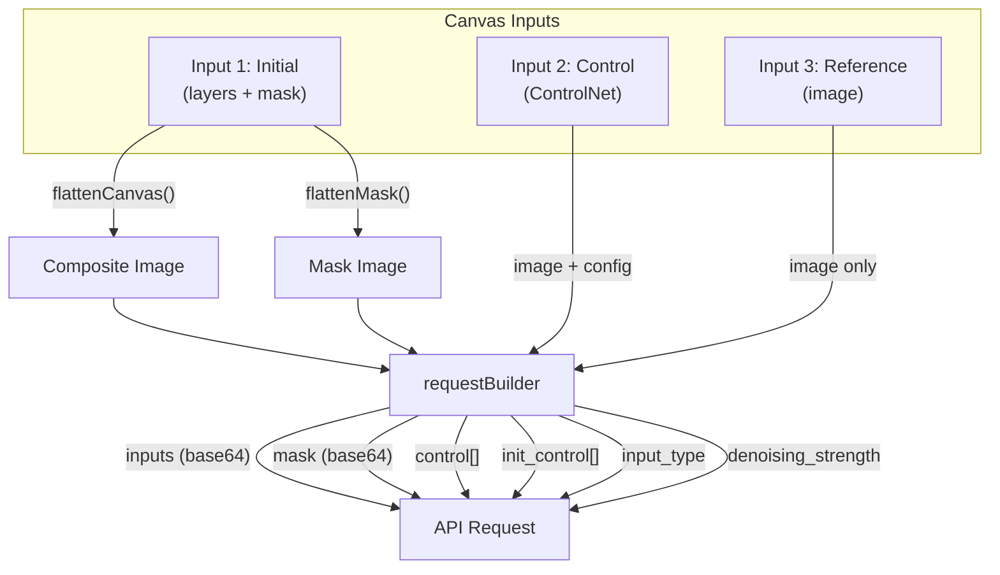

### Backend Processing

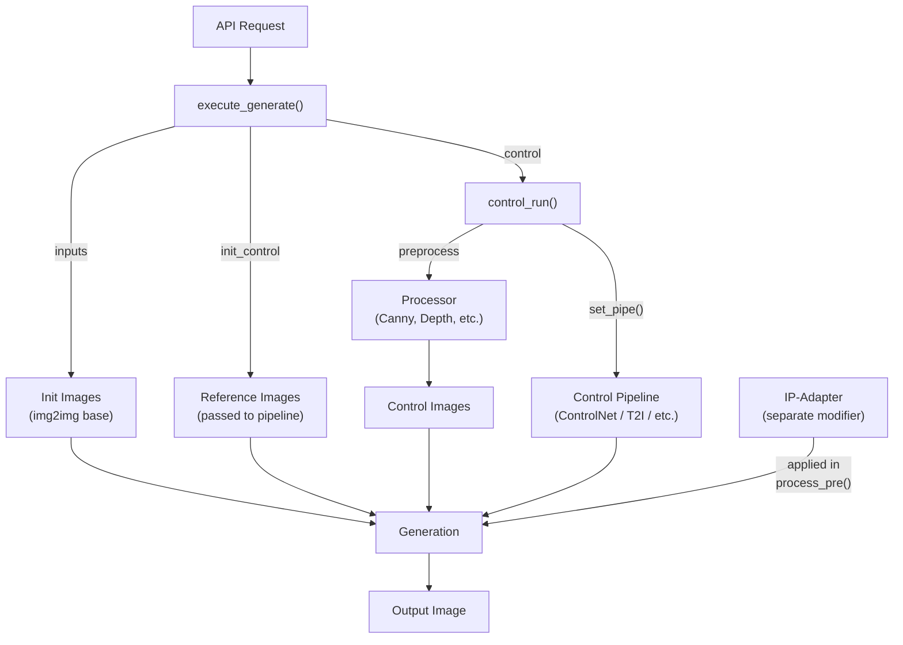

## Default Behavior

### Input 1 — Always Present

Input 1 is always visible on the canvas, defaulting to the **Initial** role. This preserves familiar behavior:

- **Empty Input 1 (Initial)** → txt2img (no init image sent)
- **Input 1 with image** → img2img (image sent with denoising)
- **User changes Input 1 to Reference** → image passed as-is (for edit models)

### Role Change Confirmation

Changing a role can be destructive (e.g., Initial → Reference discards layers and mask data). The UI should confirm destructive role changes:

```text
"Changing to Reference will discard layers and mask data. Continue?"
    [Cancel]  [Continue]
```

Non-destructive changes (e.g., Reference → Control) proceed without confirmation.

## Image Source System

Control inputs can optionally share images from other inputs instead of having their own. The image source dropdown lists all other inputs by their label:

```text
Image Source:
  [Own image]           ← default, this input has its own image
  [Input 1: Initial]    ← use the composited image from Input 1
  [Input 3: Reference]  ← use the image from Input 3
```

This replaces the current `imageSource` values (`"canvas"`, `"separate"`, `"unit:N"`) with a unified reference system that uses the same global numbering.

## Edit Models and Denoising Strength

### The Problem

Some models (Klein, Qwen Image Edit, Flux Kontext) accept an `image` parameter but are **not img2img models**. They use the image as context/reference, not as a denoising starting point. This creates a UX trap: the user sees a denoising strength slider, assumes it does something, but it's silently ignored.

### How Edit Models Actually Work

Traditional img2img adds noise to the image latents and denoises from there — `strength` controls how much noise is added (how far from the original the output can drift).

Edit models work differently:

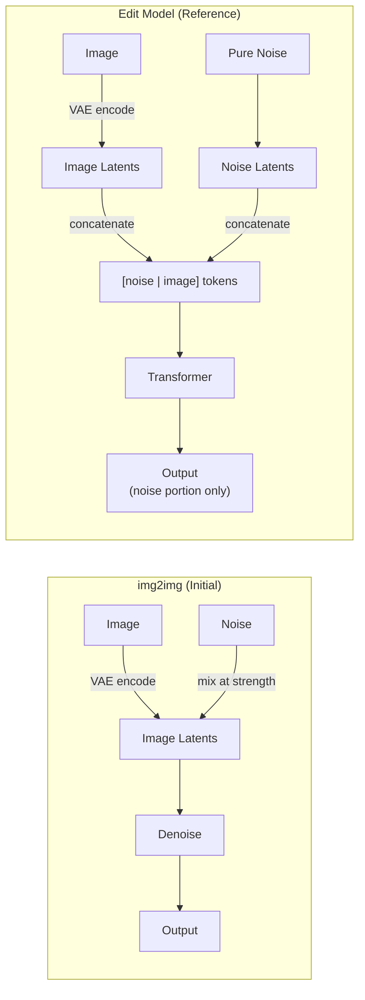

All modern edit models (Klein, Qwen Edit, Kontext) use the same pattern: image latents are concatenated as separate tokens alongside the noise latents. The transformer attends to both but only outputs predictions for the noise portion. The image is pure context — "here's what exists, now generate what the prompt asks for."

### Pipeline Signature Evidence

| Pipeline | `strength`? | `image_guidance_scale`? | Image Architecture |
| --- | --- | --- | --- |
| `StableDiffusionImg2ImgPipeline` | **Yes** | No | Noise mixed into image latents at strength |
| `FluxImg2ImgPipeline` | **Yes** | No | Noise mixed into image latents at strength |
| `FluxFillPipeline` | **Yes** | No | Inpainting — mask + image + strength |
| `Flux2KleinPipeline` | No | No | Token concat (dim=1) — context tokens |
| `QwenImageEditPipeline` | No | No | Token concat (dim=1) — context tokens |
| `QwenImageEditPlusPipeline` | No | No | Token concat (dim=1) — context tokens |
| `FluxKontextPipeline` | No | No | Token concat (dim=1) — context tokens |
| `HiDreamImageEditingPipeline` | No | **Yes** (2.0) | Channel concat (dim=-1) + triple CFG |
| `StableDiffusionInstructPix2PixPipeline` | No | **Yes** (1.5) | Channel concat + triple CFG |
| `OmniGenPipeline` | No | No | Custom `input_images` parameter |

### Three Distinct Image Architectures

```mermaid
flowchart TD
    subgraph A["1. Noise Mixing (img2img)"]
        A1[Image] --> A2[VAE Encode]
        A2 --> A3[Add Noise at Strength]
        A3 --> A4["Denoise from
        partial schedule"]
    end

    subgraph B["2. Token Concatenation (Edit)"]
        B1[Image] --> B2[VAE Encode]
        B2 --> B3["Concat as Separate Tokens
        [noise_tokens | image_tokens]"]
        B3 --> B4["Denoise full schedule
        (predict noise portion only)"]
    end

    subgraph C["3. Channel Concatenation (Instruct)"]
        C1[Image] --> C2[VAE Encode]
        C2 --> C3["Concat on Channel Dim
        [noise_channels; image_channels]"]
        C3 --> C4["Triple CFG with
        image_guidance_scale"]
    end
```

**1. Noise mixing** (standard img2img, FluxFill): `strength` controls how many denoising steps run by cutting into the noise schedule. At 0.5, generation starts halfway. The image is the denoising starting point.

**2. Token concatenation** (Klein, Qwen Edit, Kontext): image latents are VAE-encoded and concatenated as separate tokens alongside noise latents. The transformer attends to both but only predicts the noise portion. All steps always run. `strength` is not accepted — the image is pure context.

**3. Channel concatenation + triple CFG** (HiDream E1, InstructPix2Pix): image latents are concatenated on the channel dimension. Instead of `strength`, these models use `image_guidance_scale` — a classifier-free guidance weight controlling how much the output follows the input image vs the text prompt. The denoising formula is: `uncond + image_guidance_scale × (image_cond - uncond) + guidance_scale × (full_cond - image_cond)`. This is a fundamentally different control knob: it doesn't cut the schedule, it adjusts the balance between image fidelity and prompt adherence at every step. HiDream E1 also has `refine_strength` which controls when to switch from the edit LoRA to a refine LoRA during denoising — yet another distinct concept.

When SD.Next builds kwargs, `task_specific_kwargs` produces `{'image': ..., 'strength': ...}`, but the arg-filtering loop (`if arg in possible`) silently drops `strength` for any pipeline that doesn't accept it. Similarly, `image_guidance_scale` is only passed when present in the pipeline signature.

### UX Implications

For the unified input system, this means:

| Model Type | Correct Input Role | Denoising Strength | Other Image Control |
| --- | --- | --- | --- |
| Standard diffusion (SD 1.5, SDXL, Flux) | **Initial** for img2img | Meaningful — cuts noise schedule | — |
| Token-concat edit (Klein, Qwen Edit, Kontext) | **Reference** | Not accepted — silently dropped | None (image is pure context) |
| Channel-concat edit (HiDream E1, InstructPix2Pix) | **Reference** | Not accepted — silently dropped | `image_guidance_scale` controls image fidelity |
| Inpainting (FluxFill) | **Initial** | Meaningful — cuts noise schedule | Requires mask |
| OmniGen | **Reference** | Not accepted | Custom `input_images` param |

### Smart Defaults

The UI should adapt based on the loaded model:

1. **Auto-suggest role**: When the loaded model is an edit model (no `strength` in pipeline signature), default Input 1 to **Reference** instead of Initial
2. **Hide irrelevant controls**: If Input 1 is Reference, hide denoising strength entirely (don't just grey it out — hiding prevents confusion)
3. **Info hint**: When user manually switches to Initial with an edit model loaded, show a hint: "This model uses the image as a reference — denoising strength has no effect"

### Detection Method

The backend can detect whether a model is an edit model by checking its pipeline signature:

```python
import inspect
sig = inspect.signature(pipe.__call__)
supports_strength = 'strength' in sig.parameters
```

This could be exposed via the `/sdapi/v1/server-info` endpoint as a model capability flag, allowing the frontend to adapt the UI dynamically.

## Migration Path

### Phase 1 — Rename Only (Non-Breaking)

Rename existing concepts without changing architecture:

- [x] "Asset" → "Reference" in type union, dropdown, and all labels
- [x] "Reference" → "Style Transfer" in type union, dropdown, and all labels
- [x] Add `BACKEND_UNIT_TYPE` map (frontend `style_transfer` → backend `reference`)
- [x] Add `UNIT_TYPE_LABELS` for shared display names
- [x] Update `controlStore.ts` default unit type and IDB migration
- [x] Update `requestBuilder.ts` filters and type map
- [x] Update `useControl.ts` model-fetch hook with backend translation
- [x] Update `ControlFramePanel.tsx` labels and `isAsset` → `isReference`
- [x] Update `ControlUnitControls.tsx` visibility flags

### Phase 2 — Input Frame Role Toggle

Add a role selector to the Input frame header:

- [x] Add `InputRole` type (`"initial" | "reference"`) to canvas/generation stores
- [x] Add role toggle UI to Input frame header (Initial / Reference)
- [x] When role is "Reference": hide denoising strength, mask tools, layer panel
- [x] When role is "Reference": send image via `init_control` instead of `inputs`
- [x] Expose edit-model detection from backend (`/sdapi/v1/server-info` capability flag)
- [x] Auto-suggest Reference role when loaded model is an edit model
- [x] Confirm destructive role changes (Initial → Reference discards layers/mask)

### Phase 3 — Unified Input System

Full refactor to the unified "Input #" system:

- [ ] Merge Input frame and Unit frames into a single `Input` concept with roles
- [ ] Implement role picker on the "+" button (Initial / Reference / Control)
- [ ] Enforce max-one Initial constraint (disable option when one exists)
- [ ] Implement control sub-type compatibility constraints
- [ ] Unify numbering (single global counter for all inputs)
- [ ] Update image source dropdown to use unified input references
- [ ] Update `requestBuilder.ts` to map roles to backend API fields

### Phase 4 — Canvas Rendering Updates

- [ ] Initial inputs render with multi-layer Konva canvas
- [ ] Reference inputs render with simple image display
- [ ] Control inputs render with image display + fit modes
- [ ] Output and Processed frames remain unchanged
